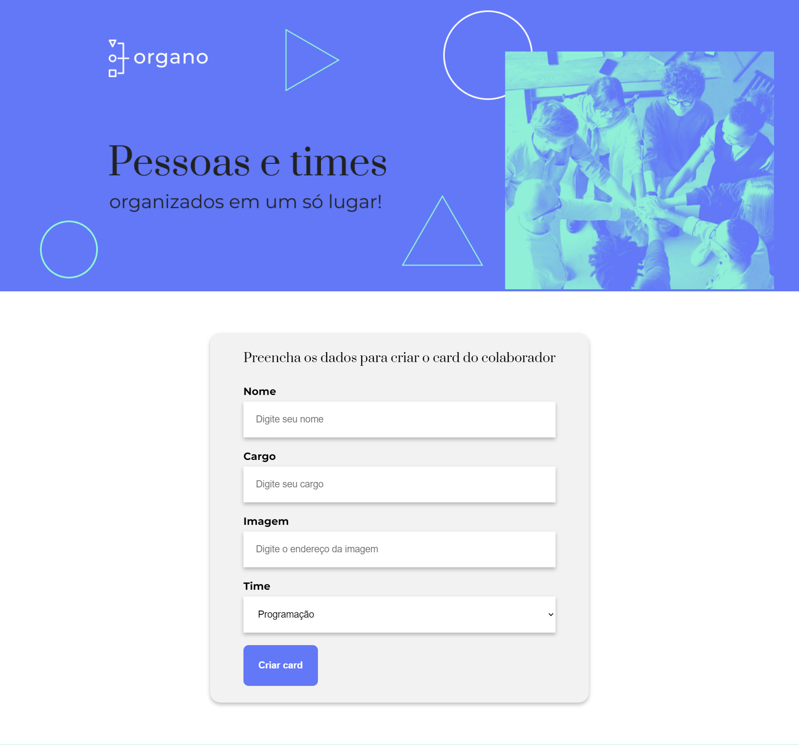
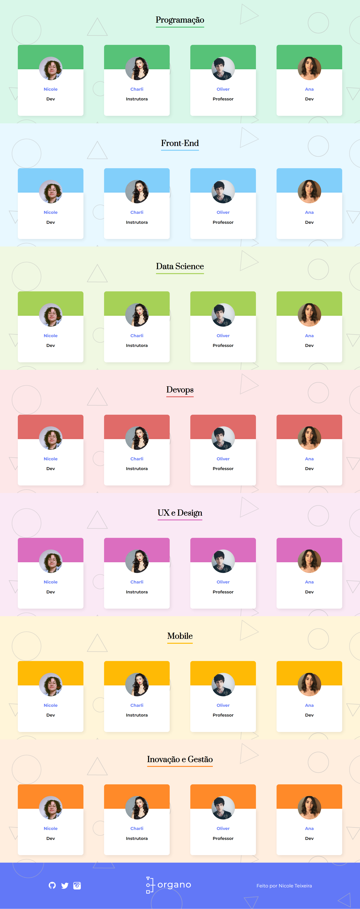

# Organo 

Um projeto de configuração da organização de uma empresa, divididos por times, cores, etc. Criado durante o curso "React: desenvolvendo com JavaScript" na Alura 

## :man_technologist: O que foi aprendido:
  - Como criar um projeto react usando Create React App
  - Organização de pastas de um projeto react
  - Estado do componente
    - hook useState
  - Criação de formulários com react
  - utilização do .map() no react
  
### :wrench: Como iniciar o projeto
  Para abrir e rodar o projeto, execute npm i para instalar as dependências e npm start para inicar o projeto.
   
  Depois, acesse http://localhost:3000/ no seu navegador.
  
  ### :computer: Imagens do projeto:
   
   
  
  

